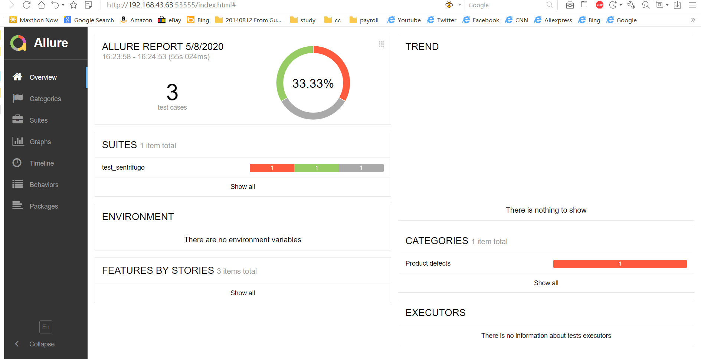

# PYTEST-ALLURE Report With Python :


#### Pre Requisites

  - Making the project as :
    ```
    mkdir pytest-execution-result-in-allure-report
	cd pytest-execution-result-in-allure-report
    ```
  - Web Scraping installation:
     ```
     open command prompt type 
        pip install virtualenv
     create virtualenv
    	>>virtualenv venv
     we need to activate virtualenv for use
    	>>venv\scripts\activate
    ```
  - Run the following command in your command line:
    ```
    pip install -U pytest
    pip install selenium
    pip install allure-pytest
    ```
  # - Way of execute program as below :
     >pytest -v -s --alluredir="E:\PYTEST\pytest-execution-result-in-allure-report\reports" test_sentrifugo.py
    
  - instructor for allure installation
    
    To install Allure, download and install Scoop and then execute in the Powershell:
    ```
        scoop install allure
    ```  
    if not execute follow commands (note : all command execute in PowerShell):
    
    ### Installs in seconds
    
    Make sure PowerShell 5 (or later, include PowerShell Core) and .NET Framework 4.5 (or later) are installed. Then run:
    ``` 
    Invoke-Expression (New-Object System.Net.WebClient).DownloadString('https://get.scoop.sh')
    ```
    
    Note: if you get an error you might need to change the execution policy (i.e. enable Powershell) with
    
    ```
    Set-ExecutionPolicy RemoteSigned -scope CurrentUser
    ```
    ```
        scoop help 
    ```
    Make sure above command is execute
    ```
    scoop install allure
    allure --version
    ```
  - NOTE : REFER THE https://scoop.sh/ THIS LINK FOR ALLURE INSTALLATION..AND ONE MORE THINK ONLY FOLLOW STARTING 4 COMMAND 
    
  - follow the project flow and run your project
   >pytest -v -s --alluredir="E:\PYTEST\pytest-execution-result-in-allure-report\reports" test_sentrifugo.py
  - after execute your porject open command prompt and follow step :
    * your will see some json file generated in your project structure in report folder
     copy the path of report folder and execute the in command prompt as below :
     
     ```
     allure serve E:\PYTEST\pytest-execution-result-in-allure-report\reports
     ```
    * after execute the command browser open and your will see the Allure report
    
         
    
  
     
     
       
    